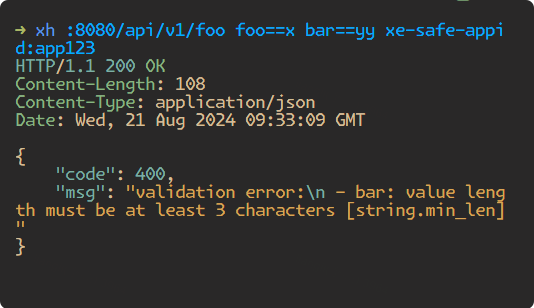

# ProtoBuf 接口参数校验

:::tip
`2024/9/10`

🆕最新 erpc new 出来的项目已经为默认配置行为,只需要在 ProtoBuf 文件里加校验规则即可！
:::

## 如何使用：
#### 1. 在 buf.yaml 添加 deps
```yaml title="buf.yaml"
version: v2
lint:
  use:
    - DEFAULT
breaking:
  use:
    - FILE
modules:
  - path: proto
deps:
  - buf.build/googleapis/googleapis
  - buf.build/bufbuild/protovalidate # 新增该行
```

#### 2. buf.gen.yaml 添加
```yaml title="buf.gen.yaml"
version: v2
managed:
  enabled: true # default: false
  disable:
    - module: buf.build/googleapis/googleapis
    # 新增下面配置
    - file_option: go_package_prefix
      module: buf.build/bufbuild/protovalidate
plugins:
  - remote: buf.build/protocolbuffers/go:v1.34.2
    out: internal/gen/proto
    opt: paths=source_relative
  - remote: buf.build/grpc-ecosystem/openapiv2:v2.21.0
    out: docs
  - remote: buf.build/grpc/go:v1.5.1
    out: internal/gen/proto
    opt: paths=source_relative,require_unimplemented_servers=false
  - remote: buf.build/grpc-ecosystem/gateway:v2.21.0
    out: internal/gen/proto
    opt: paths=source_relative
```

#### 3. Proto 添加校验规则,详细规则查看：[校验规则](https://github.com/bufbuild/protovalidate/blob/main/docs/standard-constraints.md )
```js
syntax = "proto3";

import "buf/validate/validate.proto";

message User {
  // User's name, must be at least 1 character long.
  string name = 1 [(buf.validate.field).string.min_len = 1]; // [] 内为校验规则,
}
```

#### 4. 生成代码
```js
# 在项目根目录执行

buf dep update && erpc gen 
```

#### 5. 如何使用校验代码
:::tip
要求：contrib/server/grpc-gateway 版本要求 v0.1.9
:::

```go title="/internal/server/server.go"
package server

func New(ctx context.Context, srv v1.KlMaterialOsServiceServer) server.Server {
	return grpcgw.New(
//忽略中间代码...
		grpcgw.WithGRPCServerAddress(":"+*gport),
		grpcgw.WithGRPCServerOptions(
			grpc.ChainUnaryInterceptor(
				middleware.RecoverUnaryServerInterceptor(),
				middleware.SkywalkingUnaryServerInterceptor(),
				middleware.RequestLogUnaryServerInterceptor(),
				middleware.XESafeMetadataUnaryServerInterceptor(),
+				middleware.ValidatorServerInterceptor(), // 新增该中间件
			),
//忽略中间代码...
		),
	)
}
```

### 拦截效果:

> 