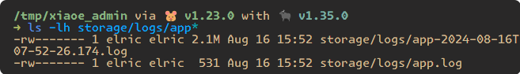
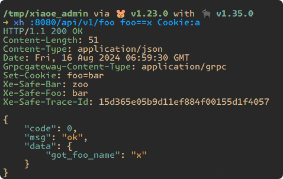
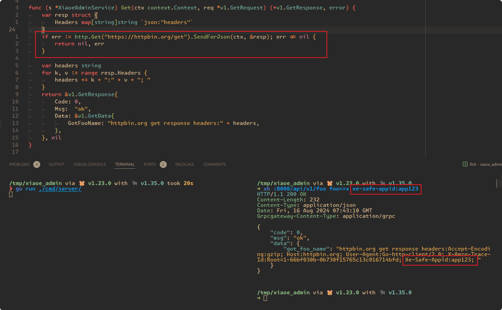

# 框架扩展

### 请求日志扩展

介绍：请求日志中间件负责记录每个进入系统的HTTP请求的详细信息,包括请求方法、URL、headers、body等,以及对应的响应状态码、耗时等.但请求日志的日志等级目前为 Debug.

功能：日志文件支持自动轮转


> 配置文件最大 **_1M_**

配置：
```js
LOG_FILENAME=./storage/logs/app.log # 日志文件名称，为空则输出至标准输出
LOG_LEVEL=info    # 最小日志等级
LOG_MAX_SIZE=100  # 日志文件最大文件大小，单位 M，最小 1M
LOG_MAX_BACKUPS=5 # 日志文件最大保留文件数量
LOG_MAX_AGE=3     # 日志文件最大保留时长，单位：day
```

### 链路追踪扩展

链路追踪中间件通过为每个请求分配唯一标识符,并在服务调用过程中传递这个标识符,从而追踪请求在分布式系统中的完整调用路径。它帮助开发人员理解请求如何流经各个服务,便于分析系统性能瓶颈和故障定位.

**功能:** 使用的是 Skywalking，支持采样率配置，支持请求返回 TraceID，如图:



配置：
```js
# 开关
TRACE_ENABLE=true 
# 采样率：0-1。0.1:10% 采样率，1:100%采样
TRACE_SAMPLE_RATE=1 
# 服务端地址
TRACE_SERVER_ADDR=skywalking-oap.skywalking.svc.cluster.local:11800 
```

### 元信息传递扩展
目前 erpc 支持元信息自动获取和设置能力，并且配合使用 erpc/http 调用组件使用时，会自动传递 Header。


:::tip LOOK
可以看出，只在请求发出加上了 xe-safe- 前缀 header，而在请求 httpbin.org 时，没手动带上任何 Header，再返回的响应则是有 Xe-Safe-Appid 的.
:::

> erpc new 出来的代码中默认支持 `xe-safe-` 前缀的 Header 透传，如需额外 Header 信息透传请使用该前缀规范。如还需额外 Header 透传能力，可自行实现实现中间件.
