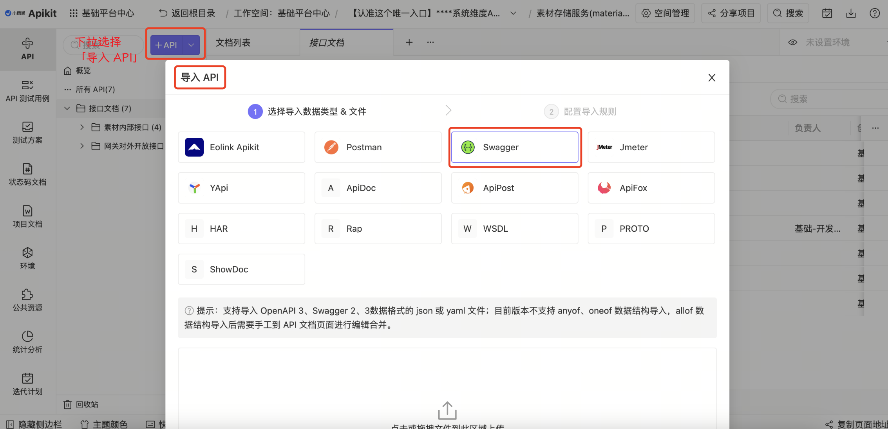
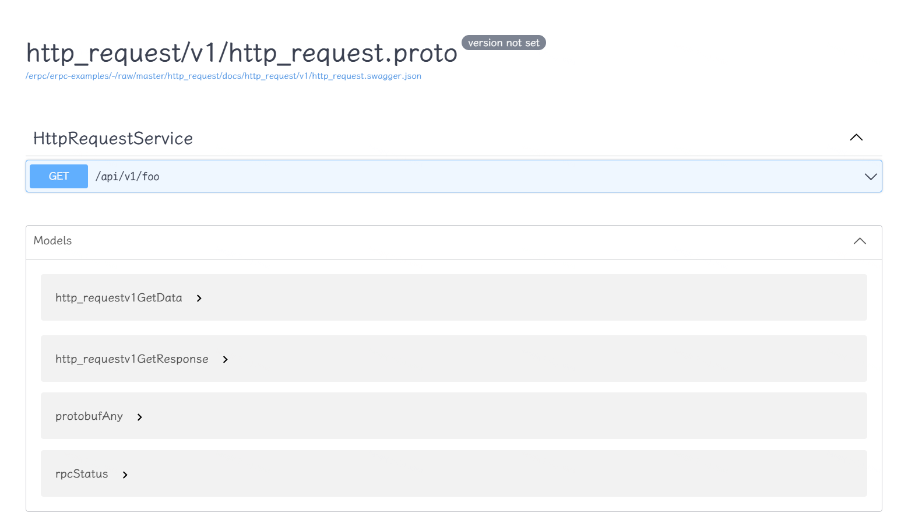

# 接口文档

### 本地查看

可以使用 erpc 开启本地 Swagger UI 方式.命令: 
```js
erpc swag -f path/to/swagger.json
``` 

命令详情 👉🏻 [**_erpc-cli-swag_**](../tools/erpc-cli.md#swag---proto-文档相关功能)

:::tip LOOK
另外，如本地有 NodeJS 环境，那么可以使用下面命令打开本地 Swagger UI。
```js
npx open-swagger-ui --open path/to/swagger.json
```
:::

截图展示:



### 导入 eolinker
进入到对应业务模块页面中，选择「导入 API」-「Swagger」，最后将对应 swagger.json 文件拖入即可
