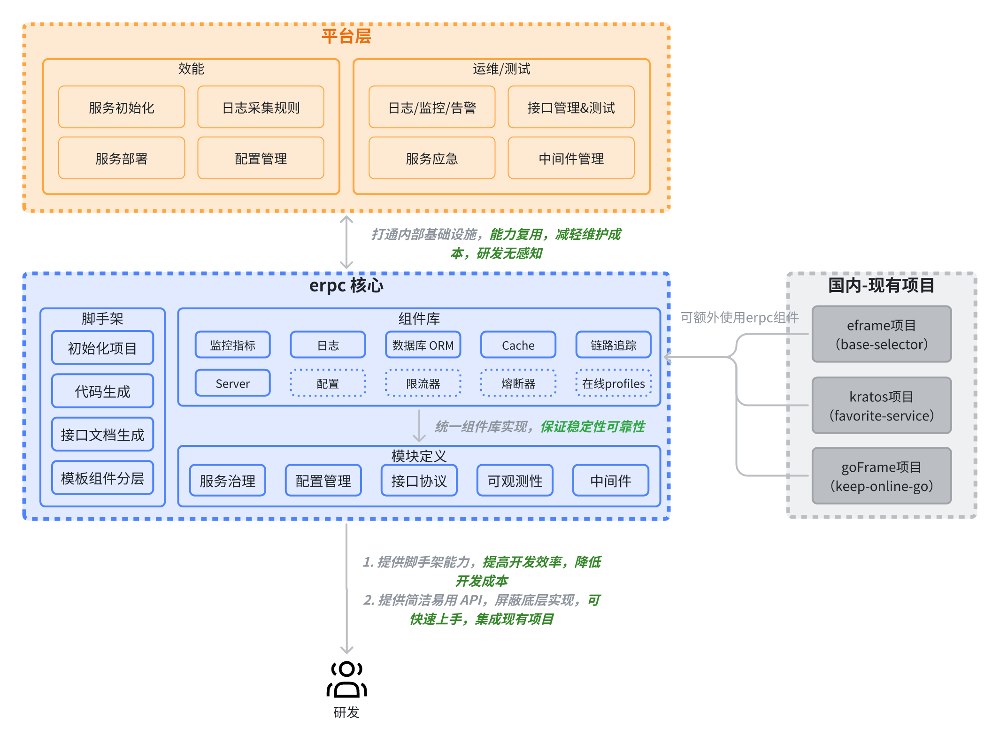
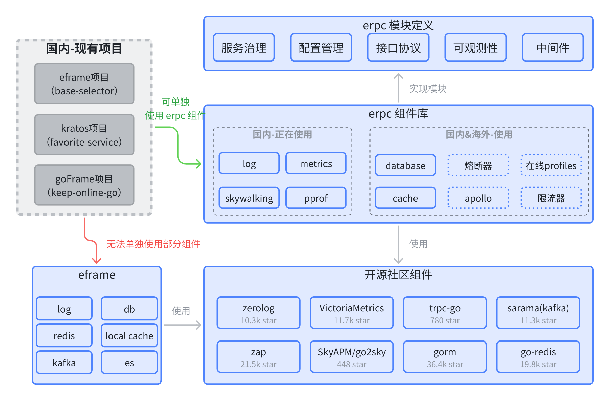

# 概览

## 背景

随着我们公司全球化战略的推进,一个统一、高效的后端开发框架变得至关重要.erpc 框架应运而生,旨在解决以下关键挑战：

- 🚀 简化开发流程,提高开发效率和代码质量
- 💰 降低接入内部基础设施的成本
- 🔧 增强系统的可维护性和可扩展性

## 技术优势

相比于原有的 eframe,erpc 框架具有以下显著优势：

1. **模块化设计**：各组件可独立使用,灵活组合,满足不同项目需求.
2. **组件通用化**：提供标准接口,支持快速替换和升级底层实现.
3. **插件化架构**：便于集成和管理各种功能模块,提高系统扩展性.
4. **全球化适配**：作为国内外开发的桥梁,确保框架在各种环境下的兼容性.
5. **降低使用成本**：简化 API 设计,提供完善文档,缩短学习曲线.

## 架构图

## 说明

- 抽象模块层,实现组件可替换插拔,也可以使用其他框架优秀的组件能力
- 提供组件库,模块层实现,国内外项目可复用组件库内组件
- 打通内部基础设施能力,例如：
  - 使用 Apollo 组件实现配置热更新
  - 使用限流器：
    1. 与运维-服务应急平台打通
    2. 实现服务级 CPU/内存自适应限流

## 模块

模块所使用的组件都是开源社区上使用最多的组件,经过了其他公司生产环境使用/验证过的.

- 组件库都是使用高 Star 的开源社区组件,经过社区/公司验证.
- eframe 原设计思想导致无法直接复用原有组件能力,没有模块化设计,导致无法替换组件实现.
- 目前 erpc 组件库已有部分组件是在国内项目使用.

