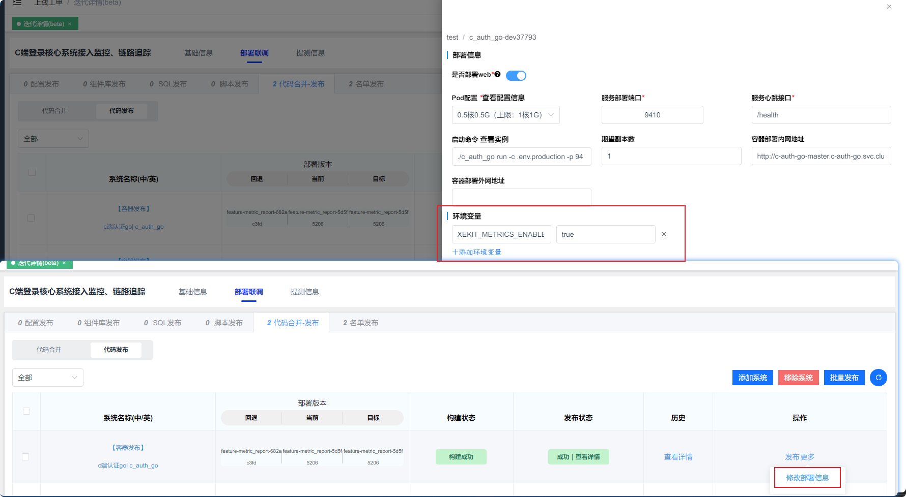
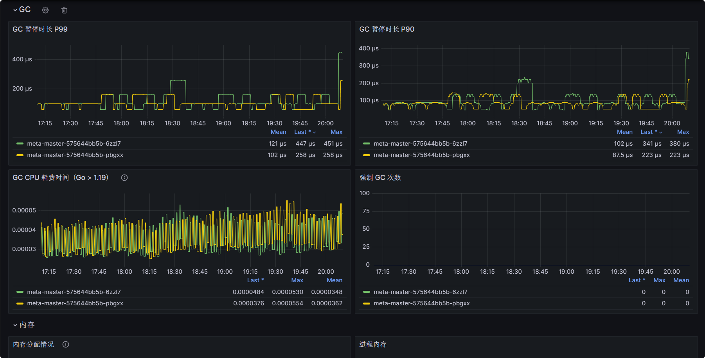
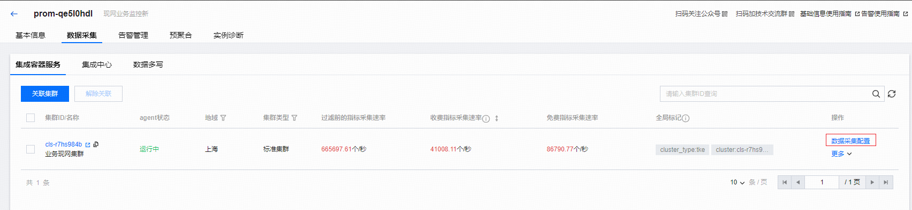
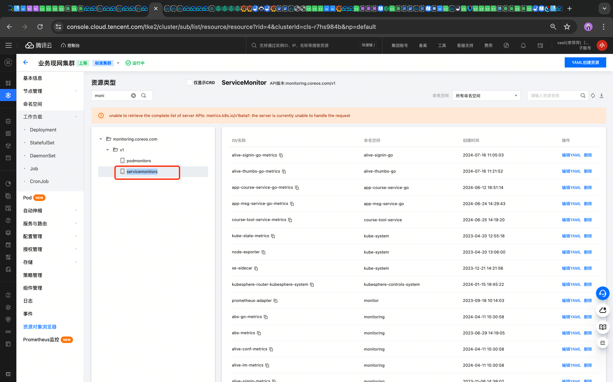

:::tip
metric 包提供了更加易用的采集指标工具方法.
仓库地址👉🏻[erpc](https://talkcheap.xiaoeknow.com/erpc/erpc/)
:::

## 使用方法

### 安装

使用 go get 安装.
```go
go get talkcheap.xiaoeknow.com/erpc/erpc@latest
```

## 指标采集
查看 [example_metric_test.go](https://talkcheap.xiaoeknow.com/erpc/erpc/-/blob/master/metric/example_metric_test.go)
接入代码示例：
```go
package metric

import (
	"os"
)

func Example_events() {
	// 事件发生次数
	EventsTotal.WithLabels(
		EventGroup, "邮件通知",
		EventName, "任务成功",
	).Inc()
	EventsTotal.WithLabels(
		EventGroup, "邮件通知",
		EventName, "接收人不正确",
	).Inc()
	EventsTotal.WithLabels(
		EventGroup, "邮件通知",
		EventName, "并发通知数",
	).Set(20)

	// 事件状态
	EventsInfo.WithLabels(EventGroup, "库存", EventName, "剩余库存").Set(233)

	EventsTotal.WithLabels(
		EventGroup, "eventAlert",
		EventLevel, AlertEventLevel,
	).Inc()

	// 快速使用
	Add("电话通知", 1)
	Set("请求量", 233)
	Alert("发送短信失败", 1)

	// 自定义指标名称
	Counter("kafka_consume_msg_total", "kafka_instance", "kafka1", "topic", "topic1").Inc()
	Gauge("php_fpm_idle_worker_num").Set(233)

	// 奇数标签键值对
	Gauge("even_metric", "foo").Set(1)

	metricsSet.WritePrometheus(os.Stdout)
	// Unordered Output:
	// app_events_occurred_total{event_group="邮件通知",event_name="任务成功"} 1
	// app_events_occurred_total{event_group="邮件通知",event_name="并发通知数"} 20
	// app_events_occurred_total{event_group="邮件通知",event_name="接收人不正确"} 1
	// app_events_info{event_group="库存",event_name="剩余库存"} 233
	// app_events_occurred_total{event_group="eventAlert",event_level="alert"} 1
	// app_events_occurred_total{event_name="电话通知"} 1
	// app_events_info{event_name="请求量"} 233
	// app_events_occurred_total{event_name="发送短信失败",event_level="alert"} 1
	// kafka_consume_msg_total{kafka_instance="kafka1",topic="topic1"} 1
	// php_fpm_idle_worker_num 233
	// even_metric{badkey="foo"} 1
}
```


## 详细说明
该部分说明具体以代码为准.

### 变量说明
- **EventsTotal:** 内置指标计数器变量,主要用于需要累加或瞬时值的事件次数,例如：Kafka 消费/生产条数、接口失败次数和当前执行任务数等等.
- **EventsInfo:** 内置指标瞬时值变量,主要用于需要瞬时值的事件次数,例如：当前执行任务数、令牌桶当前剩余数量等等,与 `EventsTotal` 不同的是,这只能是保存瞬时值.

### 方法说明
- **Add:** 基于 EventsTotal 计数器 变量的简单封装,只需要传入事件名称和值；
- **Set:** 基于 EventsInfo 瞬时器 变量的简单封装,只需要传入事件名称和值；
- **Alert:** 基于 EventsTotal 计数器变量的简单封装,只需要传入事件名称和值,内置了level:alert 标签,主要用于配置通用告警,无须额外针对指标 + Label 去配置告警；
- **Counter:** 针对 自定义指标名 和 自定义标签（Label） 的创建通用 计数器 方法；
- **Guage:** 针对 自定义指标名 和 自定义标签（Label） 的创建通用 瞬时器 方法；

## 上报（暴露）指标
暴露指标接口使用 GET 的 /metrics 路由.

现默认采集进程或 go 语言本身指标信息,如需关闭,需要配置 `XEKIT_METRICS_ENABLE` 环境变量,值为 `false`,发布工具上支持配置环境变量,在`【班车计划】`或`【迭代部署联调】`中服务代码发布中配置,路径：代码发布 - 列表中更多 - 修改部署信息.后续每个环境都需要配置,上了现网之后,无需在额外配置.


:::tip
进程指标信息有：`goroutine 数量`、`GC 时间`、`内存堆分配情况`、`进程 CPU 使用情况`等等指标.
:::

#### Go 服务监控面板
**地址** 👉🏻 [**_监控面板_**](https://monitor.xiaoe-tools.com/d/ypFZFgvmz)


import Tabs from '@theme/Tabs';

import TabItem from '@theme/TabItem';

:::tip[metrics 接入示例]
<Tabs>
  <TabItem value="HTTP" label="HTTP 接入"> 
```go
mux := http.NewServeMux()
// import "talkcheap.xiaoeknow.com/erpc/erpc/metric"
mux.Handle("/metrics", metric.HTTPHandler())
```
</TabItem>
  <TabItem value="Go-Gin" label="Go-Gin 接入"> 
```go
r := gin.Default()
// import "talkcheap.xiaoeknow.com/erpc/erpc/metric"
r.GET("/metrics", gin.WrapH(metric.HTTPHandler())
``` 
</TabItem>
</Tabs>
:::
:::warning
其他框架暂不支持
:::

### 验证
```js
curl -X GET http://localhost:8080/metrics

返回示例:
go_sched_latencies_seconds_bucket{le="0"} 0
go_sched_latencies_seconds_bucket{le="2.56e-07"} 104
go_sched_latencies_seconds_bucket{le="4.48e-07"} 104
go_sched_latencies_seconds_bucket{le="7.68e-07"} 104
go_sched_latencies_seconds_bucket{le="1.28e-06"} 104
```

## 如何接入 Prometheus
- **业务侧** 👉🏻 联系各中心业务运维
- **运维侧** 👉🏻 联系@sonmyzhao(赵晓旋)

:::note
#### 介绍:
ServiceMonitor 和 PodMonitor 是 Prometheus Operator 提供的自定义资源定义(CRD),用于在 Kubernetes 环境中动态配置 Prometheus 监控目标.ServiceMonitor 用于监控 Kubernetes Service,而 PodMonitor 用于直接监控 Pod.这两种资源允许用户以声明式的方式定义监控规则,使 Prometheus 能够自动发现和抓取指定的监控目标,从而简化了在 Kubernetes 集群中管理和扩展监控配置的过程.

#### 配置:
配置 ServiceMonitor 或 PodMonitor 主要涉及创建一个 YAML 文件,其中定义了监控目标的选择器、抓取端点和间隔等参数.这个 YAML 文件指定了要监控的 Service 或 Pod 的标签选择器,以及从哪个端口和路径抓取指标.配置完成后,使用 kubectl apply 命令将配置应用到 Kubernetes 集群中.Prometheus Operator 会检测到这些新的或更新的监控资源,并相应地更新 Prometheus 的配置,使其开始监控新的目标.
具体命令可查看下面的配置命令示例.

#### 验证:
验证 ServiceMonitor 或 PodMonitor 配置是否生效可以通过几个步骤进行.首先,使用 kubectl get 命令检查资源是否成功创建在集群中.然后,访问 Prometheus 的 Web UI,检查配置页面是否包含了新添加的抓取配置.在 Prometheus 的 "Targets" 页面中,应该能看到新添加的监控目标,并且状态应为 "UP".最后,可以在 Prometheus 查询界面尝试查询新目标的指标,确认数据正在被成功收集.如果遇到问题,检查 Prometheus Operator 的日志可能会提供有用的调试信息.

容器环境中可以配置 ServiceMonitor 或 PodMonitor,让 Prometheus 自动发现配置 ServiceMonitor 查询到的Service 下所有的 Pod 列表或 PodMonitor 查询下的 Pod列表.
:::



:::tip
#### ServiceMonitor/PodMonitor 区别
ServiceMonitor 需要一个 Service, 而 PodMonitor 不需要.
:::

具体场景：脚本类监控上报可以用 PodMonitor,Web API 相关的可以接入 ServiceMonitor.
<Tabs>
  <TabItem value="ServiceMonitor" label="ServiceMonitor 示例"> 
```js
apiVersion: monitoring.coreos.com/v1
kind: ServiceMonitor
metadata:
  labels:
    prom_id: prom-qe5l0hdl # 腾讯云 Prom ID
  name: abs-metrics # 服务指标采集配置名称
  namespace: abs # ServiceMonitor 保存的 NS
spec:
  endpoints:
  - bearerTokenSecret:
      key: ""
    interval: 15s # 采集间隔,15S 采集一次指标
    path: /prom # metric 接口地址,视服务调整
    port: web
  namespaceSelector:
    matchNames:
    - abs
  selector: # Service 标签选择器
    matchLabels:
      app: abs
    # 批量配置 branch 方式,需要取消注释以下两行
    #matchExpressions:
    #- { key: branch, operator: In, values: [release-our12122] } # branch 格式为：release-{our|gray|bug}{计划id},例如,准现网环境,计划id:12345,那么 branch: release-bug12345
```
</TabItem>
  <TabItem value="PodMonitor" label="PodMonitor 示例"> 
```js
apiVersion: monitoring.coreos.com/v1
kind: PodMonitor
metadata:
  labels:
    prom_id: prom-qe5l0hdl
  name: abs-metrics # 服务指标采集配置名称
  namespace: abs # PodMonitor 保存的 NS
spec:
  namespaceSelector:
    matchNames:
    - abs # 服务的 NS
  podMetricsEndpoints:
  - interval: 15s # 采集间隔
    path: /metrics # metric 接口地址,视服务调整
    port: web
  selector: # Pod 标签选择器
    matchLabels:
      app: abs # 服务名称,中划线全校写
    # 批量配置 branch 方式,需要取消注释以下两行
    #matchExpressions:
    #- { key: branch, operator: In, values: [release-our12122] } # 格式为：release-{our|gray|bug}{计划id},例如,准现网环境,计划id:12345,那么 branch: release-bug12345
```
</TabItem>
</Tabs>

### 配置命令示例
这些示例将帮助更好地理解配置过程.
以下命令涵盖了创建、查看、编辑和删除 ServiceMonitor 和 PodMonitor 的基本操作.
在使用这些命令时,请确保将 `<servicemonitor-name>` 和 `<podmonitor-name>` 替换为您实际的资源名称,并根据需要调整命名空间（-n 参数）.

:::tip[配置 kubectl 示例]
<Tabs>
  <TabItem value="ServiceMonitor" label="ServiceMonitor 示例"> 
```js
# 创建 ServiceMonitor
kubectl apply -f servicemonitor.yaml -n monitoring

# 查看现有的 ServiceMonitor
kubectl get servicemonitors -n monitoring

# 查看特定 ServiceMonitor 的详细信息
kubectl describe servicemonitor <servicemonitor-name> -n monitoring

# 删除 ServiceMonitor
kubectl delete servicemonitor <servicemonitor-name> -n monitoring

# 编辑现有的 ServiceMonitor
kubectl edit servicemonitor <servicemonitor-name> -n monitoring
```
</TabItem>
  <TabItem value="PodMonitor" label="PodMonitor 示例"> 
```js
# 创建 PodMonitor:
kubectl apply -f podmonitor.yaml -n monitoring

# 查看现有的 PodMonitor:
kubectl get podmonitors -n monitoring

# 查看特定 PodMonitor 的详细信息:
kubectl describe podmonitor <podmonitor-name> -n monitoring

# 删除 PodMonitor:
kubectl delete podmonitor <podmonitor-name> -n monitoring

# 编辑现有的 PodMonitor
kubectl edit podmonitor <podmonitor-name> -n monitoring
``` 
</TabItem>
</Tabs>
:::


## 如何配置告警
- **业务侧** 👉🏻 联系各中心业务运维

- **运维侧** 👉🏻 在腾讯云 Prometheus 告警规则控制台配置对应指标告警规则
