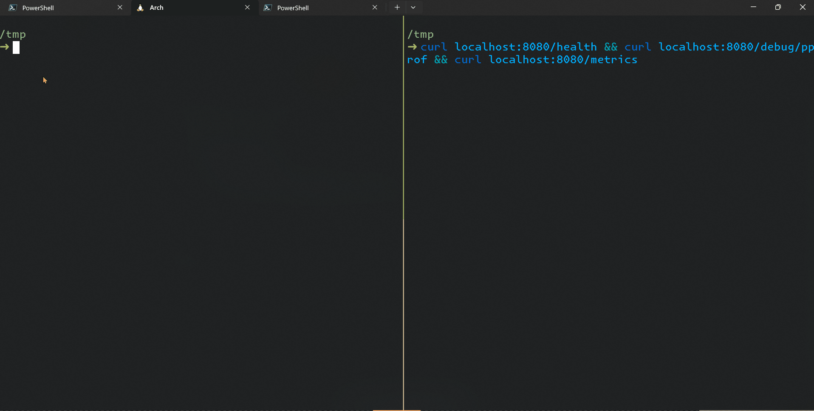

# 前置条件

### Go

- 安装方式：官网安装,最低版本：1.22（PS：Go 本身有向下兼容承诺）.
- 多版本需求可使用：[gvm: Go Version Manager](https://github.com/moovweb/gvm),Go 1.21 起,默认内置多版本支持,可查看官方介绍：[1.21 Toolchain 管理](https://go.dev/blog/toolchain)
- 安装 erpc 需配置公司 GOPROXY,详情可查看：[公司 GOPROXY 使用指引](https://doc.weixin.qq.com/doc/w3_Ac8AyAY3AKkWRL10LmjSY6NyLM7Yt?scode=ALQAnAdhAAYr1siwrZAc8AyAY3AKk),快捷命令：

  ```sh
  go env -w GOPROXY=https://goproxy.cn,http://goproxy.xiaoe-tools.com,direct GONOSUMDB=talkcheap.xiaoeknow.com
  ```

### erpc 脚手架

- erpc 框架提供的脚手架,内置集成了 new、add、gen、proto 等命令.
- 安装&升级方式：

  ```sh
  go install talkcheap.xiaoeknow.com/erpc/erpc/cmd/erpc@latest
  ```

➢ 演示 

:::tip

🎉🎉🎉 初始化完一个服务,即可拥有：**健康检查、pprof 能力、metrics 指标、日志**（图上未体现） !

:::

[init-cmop](./img/init-comp.png)

选择框架初始组件（暂只提供 gorm 和 redis）

操作指引：

- 选择: 空格 或 enter
- 删除: b 或 backspace
- Done: 选择完毕
- q: 退出选择(生成空组件框架模板)
