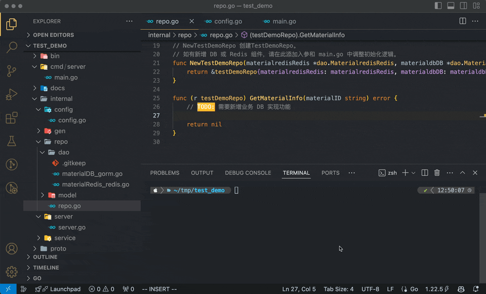
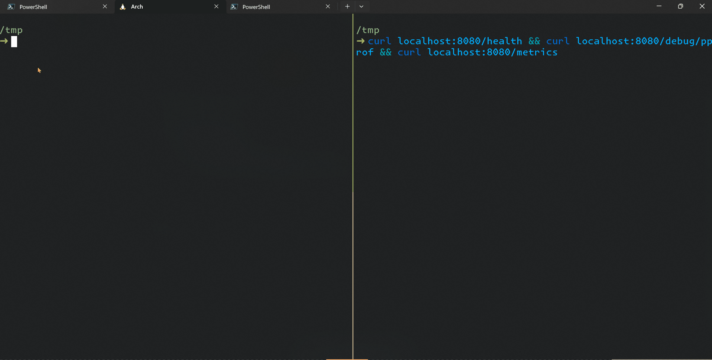
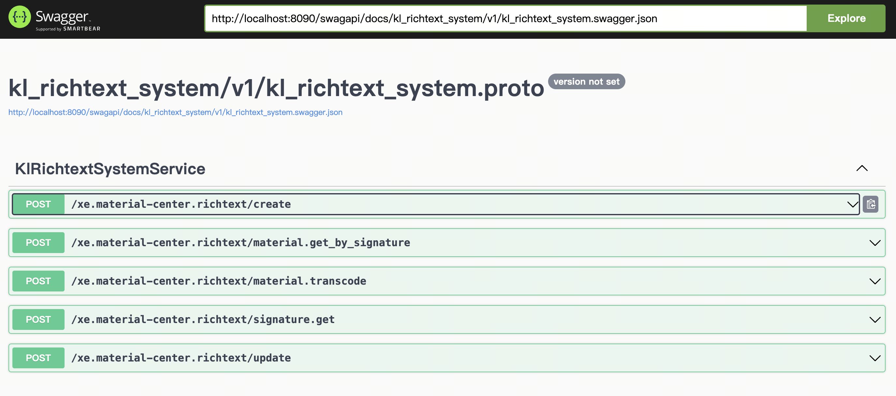
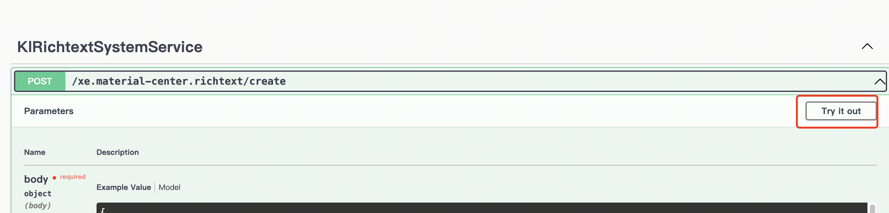
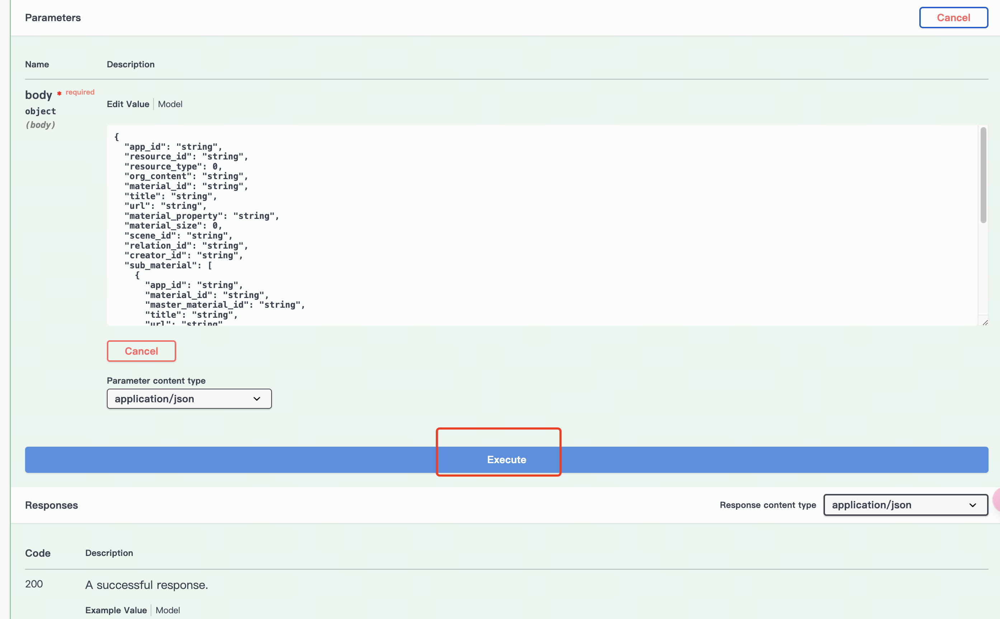

# erpc-cli

<span class="keyword-green">erpc-cli</span> 是一个集成于 <span class="keyword-green">erpc</span> 框架的命令行工具,用于简化框架的初始化、自动生成代码以及其他常用操作.它提供了便捷的命令来加速开发流程,提高开发效率.

:::note
```js
erpc -h
erpc: This is a Go rapid development framework developed by the Basic Product Center at Xiaoetong.

Usage:
  erpc [command]

Available Commands:
  comp        add new components
  gen         Automatically generate commands
  help        Help about any command
  new         Create a service template
  proto       Generate the proto files
  swag        Start Swag api server
  upgrade     Upgrade the erpc tools

Flags:
  -h, --help      help for erpc
  -v, --version   version for erpc

Use "erpc [command] --help" for more information about a command.
```
:::


## comp - 组件功能
#### 1. comp add - 添加组件
  - `-n` (必填) 组件名称. eg.`fooDB`
  - `-k` (非必填) 组件配置 KEY 公共前缀. eg.`DB_FOO_SUB_RW_HOST` 前缀为 `DB_FOO_SUB_RW`,不填为默认KEY.
  


```js
# 添加一个名为 `fooDB` 的`gorm`组件, 默认配置KEY为 `DEFUALT_KEY_XXX`
erpc comp add gorm -n fooDB 
```
```js
# 添加一个名为 `fooDB` 的`gorm`组件,配置KEY为 `DB_FOO_SUB_RW`
erpc comp add gorm -n fooDB -k DB_FOO_SUB_RW 
```

#### 2. comp list - 列出所有支持的组件
```js
erpc comp list
```


## gen - 自动生成功能 
:::warning
需要在**项目根目录**执行
:::

```js
# 自动生成并更新 proto 改动后的产物
erpc gen
```

## new - 新建项目(基于 erpc 框架)


#### 1. 新增目录创建
```go
current dir
└── foo
    ├── main.go
    └── ...
```
```js
# 创建一个名为 `foo` 的`erpc`项目(在当前目录下新增一个文件)
erpc new foo 
```

#### 2. 基于当前目录创建
```go
current dir
    ├── main.go
    └── ...
```
```js
# 基于`当前目录名称`创建一个`erpc`项目
erpc new .  
```

## proto - proto 文件相关功能

#### 1. 新增proto文件(基于初始化模版)

```js
erpc proto add foo # 新增一个名为 `foo.proto` 的`proto`文件(在项目规定的目录下)
```


## swag - proto 文档相关功能

- 生成 swagger 本地文档
  - `-f` (必填) proto 文件路径. eg. `docs/foo/v1/foo.swagger.json` 
  - `-p` (非必填) swag ui 端口号. 默认 8090.
  - `-t` (非必填) (有本地调试需求时开启)target_port 目标服务端口号. 默认 8080.

```js
erpc swag -f docs/kl_richtext_system/v1/kl_richtext_system.swagger.json
```
> 生成 swagger ui 后,访问地址: `http://localhost:8090/swagapi/index.html`



```js
erpc swag -f xxx -t 8080 # 开启本地调试功能,-t 指定的是本地已启动的服务端口号.
```




## upgrade - 更新 erpc-cli
```js
erpc upgrade
```

## 其他 - 功能
> 1. erpc-cli 具有版本检测功能, 当前版本低于最新版本时, 会主动提示更新.


> 2. erpc-cli 大部分功能可离线使用, 但是部分功能需要联网获取数据.
:::tip
如: `erpc new` 时, 会联网获取模板列表. erpc gen 时若添加新的外部引用首次生成时也需要网络支持.
:::
